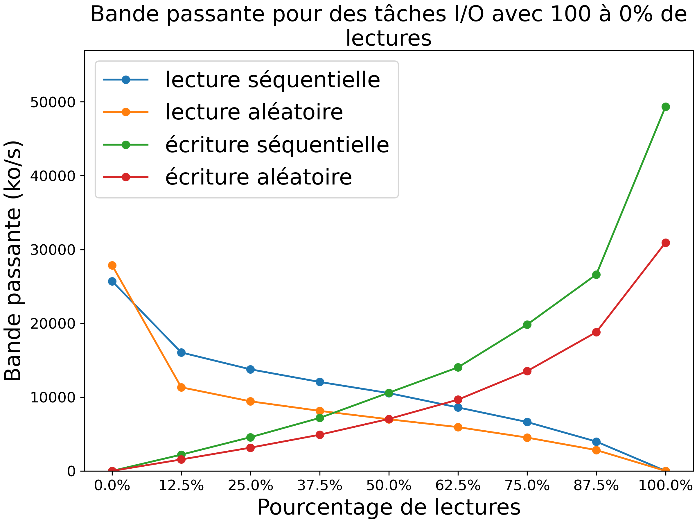

# EDP TP2

## Question 1

Figures generated with the following command:

```bash
cd question_1
python3 graph.py -s sequential.json -r random.json -o question_1.png
```




## Question 2

## Question 3

## Question 4

