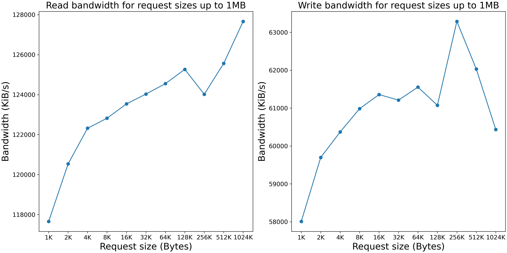
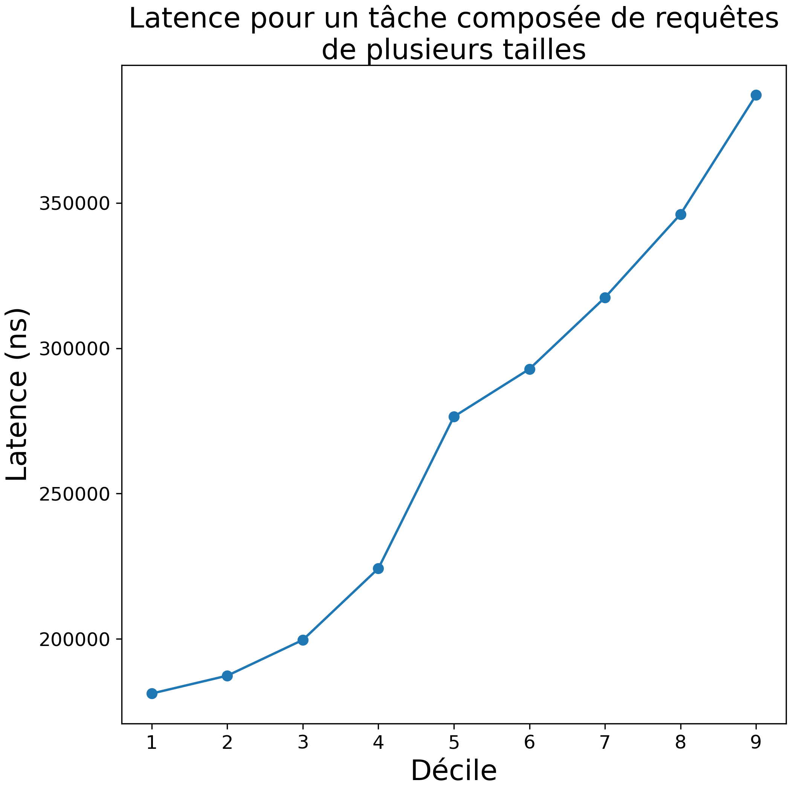
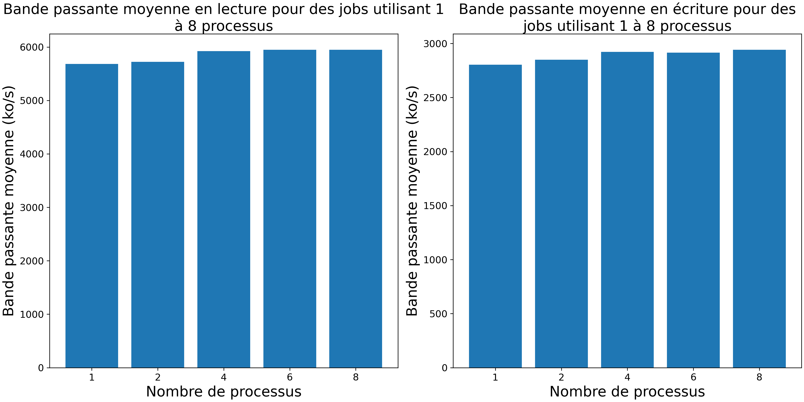
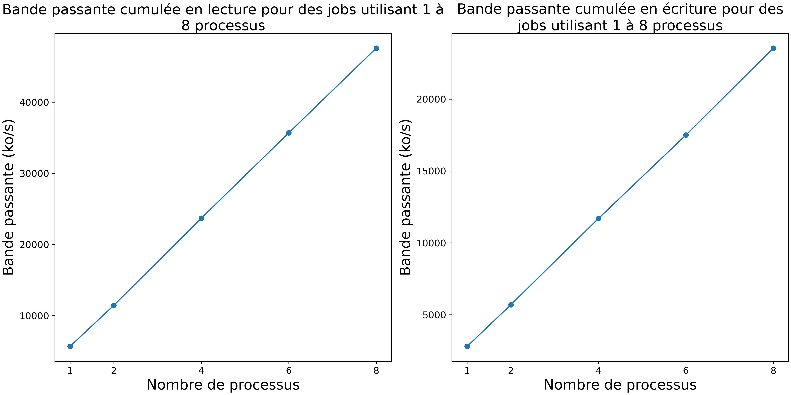

# EDP TP2

## Question 1

Figures generated with the following command:

```bash
cd question_1
python3 graph.py -s sequential.json -r random.json -o question_1.png
```


## Question 2

```bash
cd question_2
python3 graph.py variable_size.json -o blocksize_question_2.png
python3 graph.py size_q2_1proc.json -o blocksize_alt_question_2.png
```




## Question 3

```bash
cd question_3
python3 graph.py variable_percentage.json -o question_3.png
python3 bandwidth.py variable_percentage.json
python3 bandwidth.py split_q3_1proc.json
```



Bandwidth:  43759

Bandwidth:  60452

## Question 4

```bash
cd question_4
python3 graph.py threaded.json -o question_4.png
```




